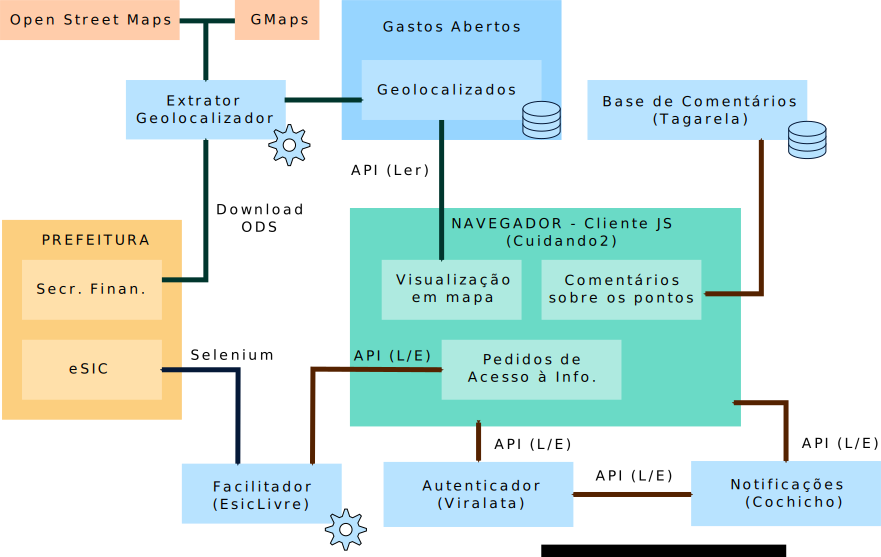

# Cuidando do Meu Bairro 2.0

Este projeto busca mapear a execução do orçamento municipal de São Paulo, não só em regiões, mas também colocando um ponto no mapa para cada despesa.

Como os [dados que pegamos da prefeitura](http://orcamento.prefeitura.sp.gov.br/orcamento/execucao.html) não têm as latitudes e longitudes de cada despesa (no máximo algumas tem a região a que se destinam), tentamos mapeá-las procurando automaticamente por endereços nos textos das descrições dessas despesas.
Para isso usamos [*expressões regulares*](https://pt.wikipedia.org/wiki/Express%C3%A3o_regular).
Uma vez extraídos esses endereços usamos serviços como [Open Street Maps](http://www.openstreetmap.org) ou Google Maps para obter suas latitudes e longitudes e então, finalmente, colocá-los em um mapa.
Porém, esse processo não é perfeito, e muitas despesas não são mapeadas, ou acabam exibidas no local errado...

Nessa segunda versão do Cuidando, pretendemos melhorar aquilo que o ele já fazia e adicionar novas funcionalidades.

Mais informações também nessa [wiki](https://pt.wikiversity.org/wiki/Projeto_Cuidando_do_Meu_Bairro).

## Arquitetura

Abaixo estão representados os diversos módulos nos quais esse projeto se baseia:

As setas avermelhadas indicam conexões em que as escritas provavelmente necessitarão de um [token](https://github.com/okfn-brasil/viralata#protocol).

Linkando para os respectivos repositórios:

- [Gastos Abertos](https://github.com/cdmb/gastos_abertos): Geolocalização e fornecimento dos dados de execução orçamentária. ([endpoint](http://demo.gastosabertos.org))
- [Vira-Lata](https://github.com/okfn-brasil/viralata): Autenticação via token (usados para acessar os outros serviços) e informações sobre o usuário. ([endpoint](http://cuidando.org.br:5002))
- [Tagarela](https://github.com/okfn-brasil/tagarela): Comentários. ([endpoint](http://cuidando.org.br:5002))
- [EsicLivre](https://github.com/okfn-brasil/esiclivre): Interface com eSIC para a realização de pedidos de informação. ([endpoint](http://cuidando.org.br:5004) - ainda não online)

### Motivação

Essa arquitetura de [micro serviços](https://en.wikipedia.org/wiki/Microservices) foi escolhida ao invés da mais convencional "monolítica" por um série de razões:

1. Necessidade de consumir dados de outros sistemas: originalmente a plataforma Cuidando do Meu Bairro consumiria dados de execução orçamentária do projeto Gastos Abertos (OKBR).
2. Restrições de hospedagem: tendo em vista o baixo orçamento do projeto, ele foi hospedado por um tempo na plataforma Openshift, que fornecia máquinas fracas, mas gratuítas, ambiente propício para micro serviços.
3. Possível menor barreira de entrada para novxs desenvolvedorxs: como os micro serviços são minimamente independentes, um(a) novx desenvolvedor(a) possivelmente só precisaria aprender sobre um dos micro serviços, e não sobre a plataforma inteira.
4. Permitir o consumo dos dados por outras plataformas: cada micro serviço pode ser reutilizado por outros sites, aplicativos e plataformas, permitindo a criação de um ecossistema de compartilhamento dos dados e serviços.

### Reveses

Ao longo do tempo alguns elementos mudaram enfraquecendo alguns dos motivos de adoção dessa arquitetura:

1. O projeto Gastos Abertos mudou de rumo, obrigando a plataforma Cuidando a arcar com a internalização, desenvolvimento e manutenção do sistema de dados de execução orçamentária.
2. A plataforma Openshift passou a cobrar por todas as máquinas não "dormentes".
